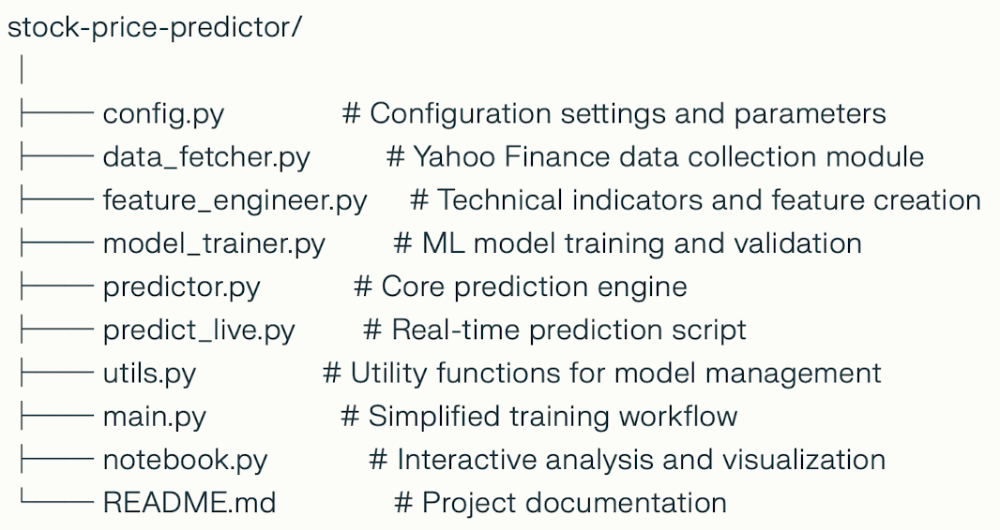

# Stock Price Movement Predictor

A comprehensive machine learning system designed to predict stock price movements in the Indian equity market using advanced technical analysis and ensemble modeling techniques.

## 🎯 Project Overview

This project combines the power of machine learning with traditional technical analysis to create a robust stock price prediction system. Built specifically for Indian markets, it leverages multiple data sources and sophisticated algorithms to forecast price movements and provide actionable trading insights.

**Key Highlights:**
- Predicts stock price movements with high accuracy using ensemble ML models
- Integrates 15+ technical indicators for comprehensive market analysis  
- Automated data fetching from Yahoo Finance API
- Real-time prediction capabilities for live trading decisions
- Interactive visualization dashboard for performance tracking
- Comprehensive backtesting framework with risk management

## 🚀 Features

### **Data Collection & Processing**
- **Automated Data Fetching**: Seamless integration with Yahoo Finance for real-time and historical data
- **Multi-timeframe Analysis**: Support for various time intervals (1m, 5m, 1h, 1d)
- **Data Validation**: Robust error handling and data quality checks
- **Historical Data Management**: Efficient storage and retrieval of market data

### **Technical Analysis Engine**
- **Moving Averages**: SMA, EMA with multiple periods
- **Momentum Indicators**: RSI, MACD, Stochastic Oscillator
- **Volatility Measures**: Bollinger Bands, Average True Range (ATR)
- **Volume Analysis**: On-Balance Volume (OBV), Volume Rate of Change
- **Trend Analysis**: ADX, Parabolic SAR
- **Custom Indicators**: Proprietary technical signals

### **Machine Learning Models**
- **Ensemble Approach**: Combines multiple algorithms for improved accuracy
  - Random Forest Classifier
  - XGBoost Gradient Boosting
  - Extra Trees Classifier
  - Support Vector Machine (SVM)
- **Feature Engineering**: Advanced feature selection and transformation
- **Cross-validation**: Robust model validation techniques
- **Hyperparameter Tuning**: Automated optimization for best performance

## 🛠️ Technology Stack

**Core Technologies:**
- **Python 3.8+**: Primary programming language
- **Pandas & NumPy**: Data manipulation and numerical computing
- **Scikit-learn**: Machine learning framework
- **XGBoost**: Gradient boosting implementation

**Data & Visualization:**
- **yfinance**: Yahoo Finance API integration
- **Matplotlib & Seaborn**: Statistical visualization
- **Plotly**: Interactive charting capabilities

## 📁 Project Structure
    
